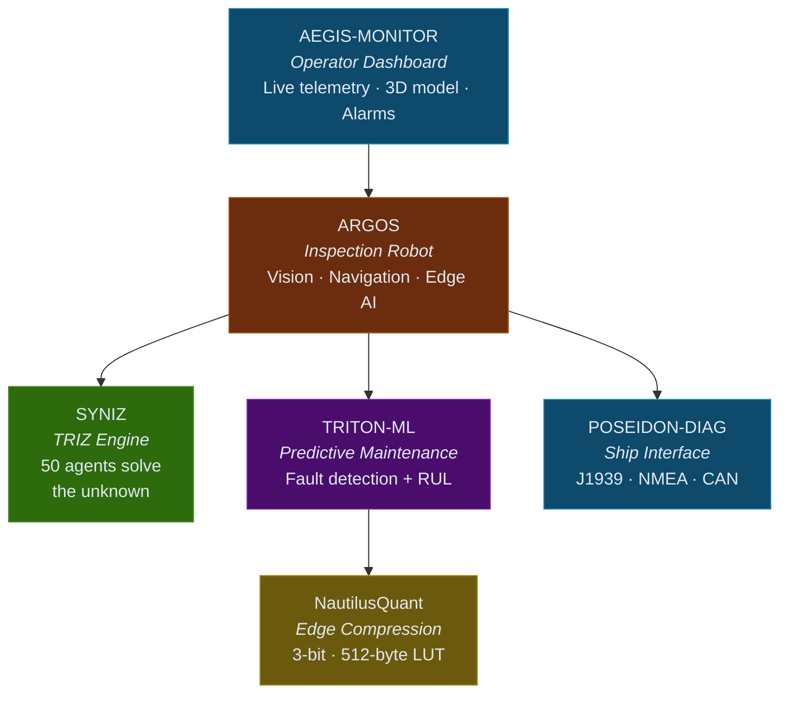

<h1 align="center">
  <br>
  
</h1>

<p align="center">
  <strong>Herman Doronin</strong><br>
  <em>Bridging ship machinery and digital systems</em>
</p>

<p align="center">
  
  
  
</p>

---

### About

Marine engineer with **3+ years** in ship power plant maintenance: main engine overhaul, turbocharger balancing, fuel injector testing, piston ring and scavenge port inspection, auxiliary diesel servicing, planned maintenance system (PMS) execution.

I build software that solves the problems I encountered hands-on — condition-based maintenance instead of fixed intervals, automated inspection of confined spaces, intelligent alarm prioritization instead of alarm fatigue.

**Rust** for CAN bus protocols (J1939, NMEA 2000). **Python** for ML, computer vision, edge inference. **TypeScript** for real-time monitoring dashboards.

### Education

**Operation of Ship Power Plants** (4 years)
Marine power plant operation, maintenance, and diagnostics.
Core curriculum: thermodynamics, marine diesel engines, steam turbines, auxiliary machinery, ship electrical systems, automation and control systems.

**STCW International Certifications**
- ISPS Code — International Ship and Port Facility Security
- Basic Safety Training (BST) — fire prevention & firefighting, personal survival techniques, personal safety & social responsibilities
- Proficiency in Medical First Aid
- Security Awareness Training

---

### Domain Knowledge

```
Ship Power Plants     ██████████  Marine Diesel Engines
Propulsion Systems    █████████░  Overhaul & Diagnostics
Auxiliary Machinery   █████████░  Pumps, Compressors, Heat Exchangers
Engine Control        ████████░░  ECU, Governor, Fuel Injection
Dry-dock Operations   ████████░░  Inspection, Repair, Reporting
```

### Maritime Protocols & Automation

<p>
  
  
  
  
  
  
  
</p>

### Software & Tools

<p>
  
  
  
  
  
  
</p>

---

### Projects

| Project | Problem It Solves | Stack |
|---------|-------------------|-------|
| [**ARGOS**](https://github.com/ORTODOX1/ARGOS) | Hull and tank inspections cost $50-100K and put humans at risk. ARGOS automates inspection in confined spaces with edge AI and TRIZ reasoning | Python, Rust, ROS 2, ONNX |
| [**POSEIDON-DIAG**](https://github.com/ORTODOX1/POSEIDON-DIAG) | Unplanned engine failure costs $50K-500K/day. Real-time CAN bus diagnostics with AI anomaly detection catch failures before they happen | Rust, Tauri, React, CAN |
| [**TRITON-ML**](https://github.com/ORTODOX1/TRITON-ML) | Time-based maintenance wastes 30-50% of budget. ML predicts actual equipment condition 2-4 weeks before traditional alarms | Python, XGBoost, PyTorch, SHAP |
| [**SYNIZ**](https://github.com/ORTODOX1/SYNIZ) | IMO 2030/2050 requires radical engineering innovation. 50 TRIZ agents debate contradictions to accelerate R&D cycles | Python, FastAPI, Neo4j, D3.js |
| [**AEGIS-MONITOR**](https://github.com/ORTODOX1/AEGIS-MONITOR) | Operators monitor 500+ parameters with alarm fatigue. Dashboard with 3D ship model and intelligent alerting reduces response time | React, TypeScript, Three.js |
| [**NautilusQuant**](https://github.com/ORTODOX1/NautilusQuant) | Satellite bandwidth is 64-512 kbps. 4x deterministic compression enables shipboard AI without cloud dependency | Python, PyTorch, Triton GPU |

### Ecosystem



The robot sees. The ML classifies. TRIZ reasons about the unknown. The human makes the final call.

**[Read the full engineering vision: from fundamental physics to autonomous systems →](VISION.md)**

---

### Target Roles

- Marine Automation Engineer
- Vessel Performance / Condition Monitoring Engineer
- Embedded Systems Engineer (Maritime)
- Naval Systems Integration Engineer

---

<p align="center">
  <em>"Most software engineers have never touched a marine diesel.<br>Most marine engineers have never written a GPU kernel.<br>I do both."</em>
</p>
