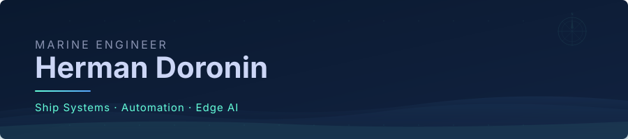
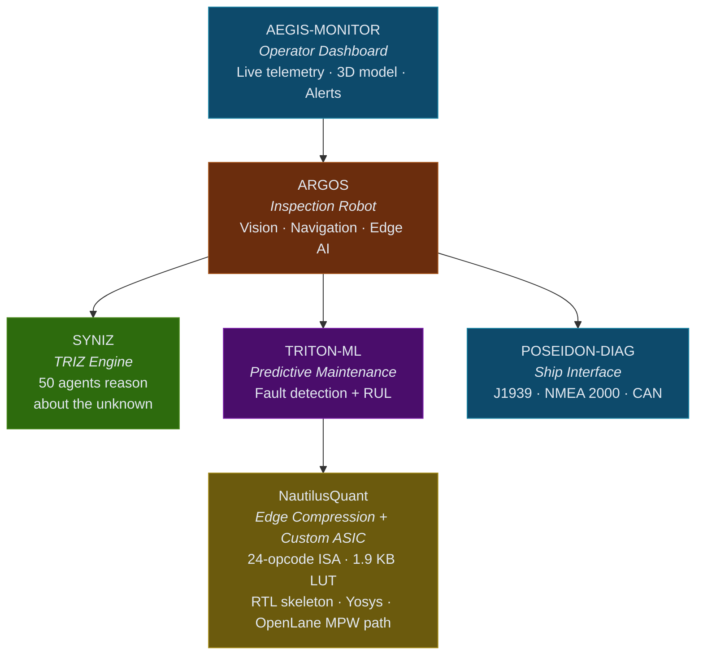

<p align="center">
  
</p>

<p align="center">
  
  
  
  
</p>

<p align="center">
  <strong>Marine engineer building the AI — and now the silicon — that runs in the engine room.</strong><br>
  <em>From engine room to ASIC. From J1939 to LLM inference.</em>
</p>

---

### About

3+ years hands-on in commercial marine power plants — medium-speed and high-speed 4-stroke diesel engines, mechanical fuel-injection systems (Bosch P-pump rebuilds), turbocharger overhaul and dynamic balancing, fuel-injector pressure testing, scavenge-space and piston-ring inspection, auxiliary genset servicing, planned-maintenance-system execution. The kind of detail you only learn with grease on your hands.

Hands-on with both legacy mechanically-governed engines (Bosch P-pump + pneumatic / Woodward governors) and modern ECU-controlled repower projects (Caterpillar ADEM, Cummins CM-series, J1939 telemetry).

Every project I build came from a problem I saw on board. I solve it at the layer where it actually needs to be solved — sometimes Python, sometimes a Rust crate over J1939, sometimes SystemVerilog targeting Skywater 130 nm.

| Problem on board                                    | What I built                                                                |
|-----------------------------------------------------|-----------------------------------------------------------------------------|
| Confined-space inspections are expensive and risk lives | **ARGOS** — autonomous inspection robot (edge AI + TRIZ reasoning)           |
| Unplanned engine failure stops the ship                | **POSEIDON-DIAG** — real-time J1939 / NMEA 2000 diagnostics + AI anomaly detection |
| Time-based PMS replaces parts that are still healthy  | **TRITON-ML** — RUL prediction 2–4 weeks ahead of classical alarms            |
| Operators ignore alarms past 500+ params              | **AEGIS-MONITOR** — 3D ship dashboard with intelligent prioritization         |
| IMO 2030/2050 demands radical engineering R&D         | **SYNIZ** — 50 TRIZ agents debating contradictions to compress R&D cycles     |
| Satellite uplink is 64–512 kbps, cloud AI doesn't fit | **NautilusQuant** — deterministic KV-cache compression, ROM-LUT instead of a stored matrix |

---

### Ecosystem



The robot sees. The ML predicts. TRIZ reasons about the unknown. NautilusQuant fits inference into the satellite pipe — and now into custom silicon. The human makes the final call.

**[Read the full engineering vision: from protocol layer to autonomous systems →](VISION.md)**

---

### Projects

| Project | Status | Problem it solves | Stack |
|---------|--------|-------------------|-------|
| [**NautilusQuant**](https://github.com/hermandoronin/NautilusQuant) | 🧪 research · v0.1.0 · 247 tests | Satellite uplink 64–512 kbps — shipboard AI without cloud dependency. 1.9 KB ROM-LUT instead of a stored rotation matrix; 24-opcode ISA and an RTL skeleton on the OpenLane path. Benchmarks incl. the negative result are in the repo. | Python · PyTorch · Triton · SystemVerilog · Yosys · OpenLane |
| [**ARGOS**](https://github.com/hermandoronin/ARGOS) | 🧪 prototype | Hull and tank inspections are expensive and put humans at risk. Edge AI + TRIZ reasoning for confined spaces. | Python · ONNX · OpenCV · CAN |
| [**POSEIDON-DIAG**](https://github.com/hermandoronin/POSEIDON-DIAG) | 🔄 active | Unplanned engine failure is the most expensive event at sea. J1939 / NMEA 2000 decoding as a Rust workspace — protocol layer works, tests green. | Rust · J1939-71 · NMEA 2000 · SocketCAN |
| [**TRITON-ML**](https://github.com/hermandoronin/TRITON-ML) | 🔄 active | Time-based maintenance replaces parts that are still healthy. ML on vibration/thermal/operational features estimates true condition instead. | Python · XGBoost · PyTorch · SHAP · ONNX |
| [**SYNIZ**](https://github.com/hermandoronin/SYNIZ) | 🧪 prototype | IMO 2030/2050 demands radical engineering. A swarm of TRIZ agents debates contradictions instead of one model guessing. Interface and prompts are Russian for now. | Python · FastAPI · Neo4j · React |
| [**AEGIS-MONITOR**](https://github.com/hermandoronin/AEGIS-MONITOR) | 🔄 active | 500+ parameters cause alarm fatigue. 3D ship dashboard with prioritised alarms; runs on a mock data server. | React 19 · TypeScript · Three.js · Vite |

#### Cross-domain / experimental

| Project | Status | Problem it solves | Stack |
|---------|--------|-------------------|-------|
| [**arc-computer**](https://github.com/hermandoronin/arc-computer) | 🧪 experiment | Engineering knowledge that works without internet or subscription. This repo publishes the knowledge-base pipeline only. | Python · offline knowledge base |

---

### Tech Stack

**Hardware & Silicon**
<p>
  
  
  
  
  
  
  
</p>

**ML / AI / Robotics**
<p>
  
  
  
  
  
  
</p>

**Marine Engine Systems**
<p>
  
  
  
  
  
  
  
</p>

**Marine Automation & Industrial Protocols**
<p>
  
  
  
  
  
  
</p>

**Edge & Systems**
<p>
  
  
  
  
  
</p>

**Web & Visualization**
<p>
  
  
  
  
  
  
</p>

---

### Domain Knowledge

```
Ship Power Plants     ██████████  Marine Diesel Engines
Propulsion Systems    █████████░  Overhaul & Diagnostics
Auxiliary Machinery   █████████░  Pumps · Compressors · Heat Exchangers
Engine Control        ████████░░  ECU · Governor · Fuel Injection
Dry-dock Operations   ████████░░  Inspection · Repair · Reporting
```

---

### Education & Certifications

**Operation of Ship Power Plants** — 4-year diploma program · graduated **2022**.
Thermodynamics · marine diesel engines · steam turbines · auxiliary machinery · ship electrical systems · automation & control.

**STCW International**: ISPS · Basic Safety Training (fire prevention, survival, personal safety) · Proficiency in Medical First Aid · Security Awareness Training.

**Languages**:
<p>
  
  
  
</p>

---

### Open to

**Maritime / Marine Automation**
- Marine Automation Engineer
- Vessel Performance / Condition Monitoring Engineer
- Embedded Systems Engineer (Maritime)
- Naval Systems Integration Engineer

**Hardware / ML systems** *(marine-domain expertise as differentiator)*
- Hardware/Software Co-design Engineer
- FPGA / ASIC Engineer (LLM inference acceleration)
- ML Inference Optimization Engineer
- Pre-silicon Verification Engineer

---

<p align="center">
  <em>"Most software engineers have never touched a marine diesel.<br>
  Most marine engineers have never written a GPU kernel.<br>
  Most GPU engineers have never designed the silicon underneath.<br>
  Three layers. One engineer."</em>
</p>
